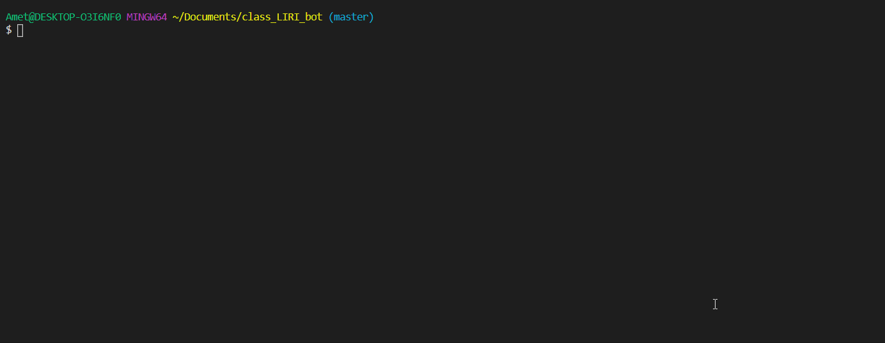

# LIRI_bot

Clearly state the problem the app is trying to solve (i.e. what is it doing and why)

## the application is a collection of resources put together in an easy to use format for surfing bands, venues, songs, and movies. perfect for those slow days sitting around the command line with nothing to do.

Give a high-level overview of how the app is organized

## The app is broken up into a series of functions that pull from various api, linked together via loose logic and the inquirer system. axio is used to pull from the OMDB and Bands In Town apis, and spotify is off doing its own thing in the middle distance.

Give start-to-finish instructions on how to run the app

## In order to run this app yourself, pull the repo and (assuming you have VS code, git bash, and nodejs) type npm install or npm init (I forget which installs all them dependencies).

### You'll need to create your own file named .env and inside it place your own spotify api keys which you can get .
### Paste them in the format:
#### SPOTIFY_ID=YOUR_SPOTIFY_ID_HERE
#### SPOTIFY_SECRET=YOUR_SPOTIFY_SECRET_HERE

### after this you're ready to go. simply type in node LIRI.js and follow the prompts. You can also skip directly to the specific commands you want to run by typing node LIRI.js {command-here} separated by dashes rather than spaces. The LIRI bot is somewhat forgiving and can take instructions with a combination of spaces and dashes, though for best results separate everything with spaces when not inputting commands directly, and dashes when doing so.

Include screenshots, gifs or videos of the app functioning

Contain a link to a deployed version of the app

## "As this is a CLI App, it cannot be deployed to GitHub pages or Heroku" yes I'm sorry what?

Clearly list the technologies used in the app

## Node-Spotify-API, Axios, OMDB, Bands In Town, Momentjs, DotEnv, fs, inquirer.

State your role in the app development

## I made it. All of it. It was all me. Everything.
